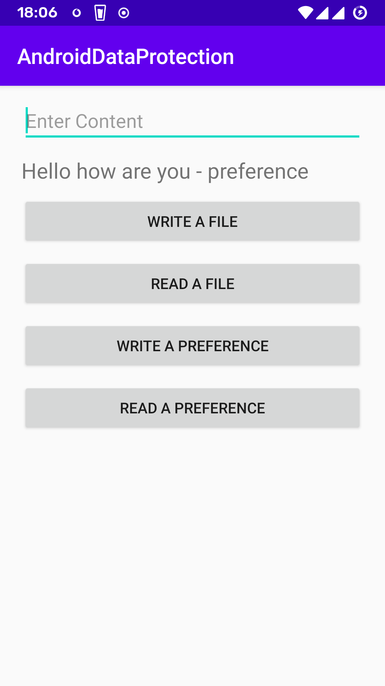

# android-data-protection
Android introduced Jetpack Security which gives more control over data encryption to save our data. Right now, we have Encrypted File System and Encrypted Shared Preference.

If your are going to use RC version please use the min API version 23 (It is changed in 1.1.0-alpha01 version).

Here I used alpha version to demonstrate, How the Jetpack Security is worked.

```
dependencies {
    implementation "androidx.security:security-crypto:1.0.0-rc02"
}
```

```
dependencies {
    implementation "androidx.security:security-crypto:1.1.0-alpha01"
}
```

  

For more details,
</br>https://developer.android.com/jetpack/androidx/releases/security
</br>https://developer.android.com/topic/security/data
